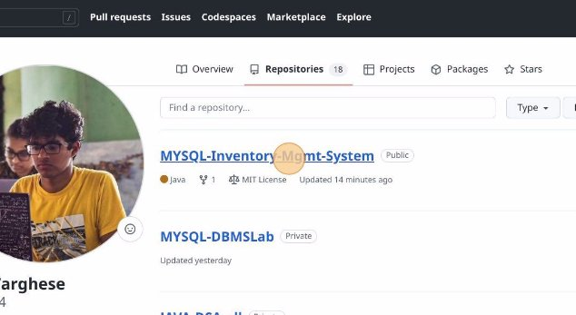
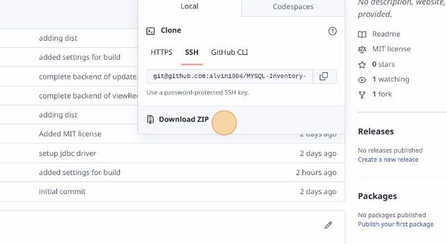

Inventory Management ![] System installation

1  Navigate to [github.com/alvin1904](https://github.com/alvin1904)
1  Click "Repositories"
3  Click "MYSQL-Inventory-Mgmt-System"
3  Click "Code" and then Click "Download ZIP"
5  Extract the downloaded file.

Java connector download site:
https://dev.mysql.com/downloads/connector/j/
